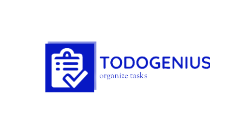

# TODOGENIUS



TODOGENIUS is a user-friendly application that helps you stay organized and manage your tasks efficiently. The app combines the simplicity of a to-do list with the functionality of FullCalendar, a powerful JavaScript library for creating interactive calendars.

## Table of Contents
- [How the System Works](#how-the-system-works)
- [Tools of Trade](#tools-of-trade)
- [Getting Started](#getting-started)
- [Author](#author)

## How the System Works

Users access the web app, tasks are shown in both list and calendar formats. They interact with tasks, changes are synced with the API, and updates are reflected in the list and calendar. Efficient task management with visual representation.

## Tools of Trade

<div>
    &nbsp;
   &nbsp;
   &nbsp;
   &nbsp;
   &nbsp;
   &nbsp;
</div>
In the backend, Django is used to interact with the API, while in the frontend, CSS, HTML, and JS are employed for the user interface.

## Getting Started

### Prerequisites

- Python (version 3.10.8)
- Django (version 4.2.1)

### How to run

1. Clone the repository.
    'git clone https://github.com/cisco2001/ToDoGenius.git'
2. Create and activate a virtual environment.
    ```
    python3 -m venv .venv
    source .venv/bin/activate
    ```
3. Install the required dependencies using pip from requirements.txt file.
    ```pip install -r requirements.txt
    ```
6. Start the development server.
    ```
    python manage.py runserver
    ```


### Usage


## Author

- Full Name: Mtwa Johakim Mgimwa
- GitHub: [github.com/cisco2001](https://github.com/cisco2001)
- LinkedIn: [linkedin.com/in/](https://linkedin.com/in/cisco2001)
